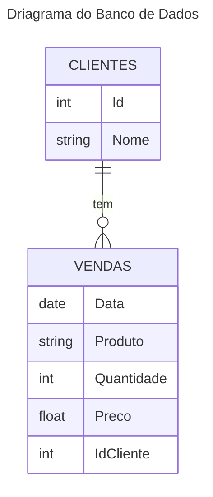

# Case egd_ex01 de Engenharia de Dados para o Canal e Blog DadosBr


## Introdução
Olá, inscritos e seguidores do [canal YouTube](https://www.youtube.com/@DADOSBRASIL) e [blog](https://www.brdados.com.br/) DadosBR! 

Atendendo a inúmeras solicitações, estamos lançando um case prático de Engenharia de Dados que aborda a criação e gerenciamento de um pipeline de dados usando PySpark e Delta Lake. 

Este projeto é uma excelente oportunidade para você aprofundar seus conhecimentos e habilidades em áreas fundamentais da engenharia de dados.

## O Que Você Vai Aprender


Neste case, você terá a chance de:

- Entender a estrutura de um Data Lake e suas camadas (Bronze, Silver, Gold).
- Aprender a utilizar Delta Lake para armazenamento de dados confiável.
- Implementar técnicas de UPSERT para manipulação de dados.
- Utilizar PySpark para mover e transformar grandes volumes de dados.
- Orquestração de dados com Airflow


## Detalhes do Case

O projeto consiste em desenvolver quatro scripts PySpark, cada um com objetivos e funcionalidades específicas no pipeline de processamento de dados. Você será guiado em como mover dados entre diferentes camadas do Data Lake, desde a camada inicial até camadas mais refinadas e prontas para análise.

Além dos scripts, forneceremos uma documentação detalhada que explica cada etapa, tornando este case não apenas um exercício prático, mas também uma experiência de aprendizado completa.


## Para Quem É Este Case?

Este case é ideal para quem já possui algum conhecimento em Python e SQL e deseja entrar no mundo da Engenharia de Dados. Também é útil para profissionais da área que desejam aprimorar suas habilidades em ferramentas e técnicas modernas.

## Organização do Projeto

A organização de pastas é crucial para manter o projeto escalável e fácil de entender. Aqui está uma sugestão de estrutura de diretórios para o seu projeto:

```
MeuProjeto/
├── .devcontainer/
│   ├── Dockerfile
│   ├── docker-compose.yml
│   └── devcontainer.json
├── data/
│   └── stage
│   └── bronze
│   └── silver
│   └── gold
├── sql/
│   └── vendas.sql
│   └── clientes.sql
├── dags/
│   └── dag_main.py
├── pyspark_scripts/
│   └── transformacao_de_dados.py
├── requirements.txt
└── README.md
```

### Descrição:

 - `.devcontainer/`: Contém todos os arquivos necessários para o DevContainer, como Dockerfile, docker-compose.yml e devcontainer.json. Aqui está a configuração do ambiente para o seu desenvolvimento. 

- `data/`: Armazena os dados do seu projeto. Leia mais clicando [aqui.](/data/data.md)

- `sql/`: Contém scripts SQL, como vendas.sql e clientes.sql para criação de tabelas e inserção de dados. Caso queira mais dados, ou alterar algo nos dados, você pode customizar o `generate_data_sql.py`. 

- `dags/`: Contém os arquivos DAG do Airflow, como dag_main.py.

- `pyspark_scripts/`: Contém os scripts PySpark para transformações de dados, [click aqui](/pyspark_scripts/pyspark_scripts.md) para saber o que voce tem que desenvolver.

- `requirements.txt`: Lista todas as bibliotecas Python necessárias.

- `README.md`: Documentação do projeto, explicando como configurar e executar o projeto.


## Diretrizes para resolver o Case

### 1 . Conectando no banco de dados e inserindo os registros. 

Para executar comandos SQL em um contêiner Docker que está executando o MySQL, você pode usar o seguinte procedimento:

`1-Acessar o Contêiner`: Primeiro, você precisa acessar o shell do contêiner MySQL. Use o comando abaixo, substituindo nome_do_contêiner pelo nome real do seu contêiner MySQL. Eu recomendo criar um terminal para isso. Precione `Ctrl Shift +` para criar um terminal

```shell
docker exec -it egd_ex01_devcontainer_db_ bash
```

`2-Acessar o MySQL`: Uma vez dentro do shell do contêiner, você pode se conectar ao serviço MySQL usando o comando:

Você será solicitado a fornecer a senha do usuário root do MySQL.

```shell
mysql -u root -p
```
A senha do banco de dados é `mysql123`. 

`3- Executar Comandos SQL`: Após o login, você estará no shell do MySQL e poderá executar seus comandos SQL.

Agora você pode criar o banco de dados e colocar os dados. 
Em baixo voce vai encontrar o diagrama desse banco.

Copie o script o cole no terminal que esta conectado no mysql.
Execute nessa ordem no banco de dados os seguintes scripts:

1º - [sql/ddls.sql](/sql/ddls.sql)
2º - [sql/clientes.sql](/sql/clientes.sql)
3º - [sql/vendas.sql](/sql/vendas.sql)



## Autores do Case

- `Wellington Faria` - [Linkedin](https://www.linkedin.com/in/wellicfaria/) - [GitHub](https://github.com/wellicfaria)
